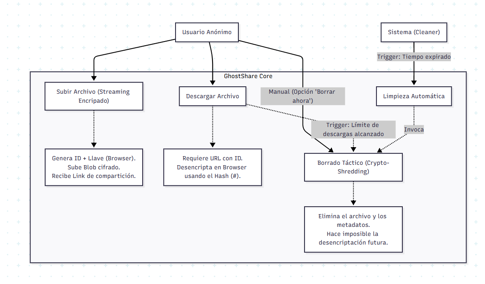

# 👻 GhostSend

<p align="center">
  <strong>Comparte archivos de forma anónima, segura y efímera.</strong>
</p>

<p align="center">
  
  
  
  
</p>

---

## 📖 Descripción

**GhostSend** es una API REST para compartir archivos de forma temporal y anónima. Los archivos subidos pueden tener un tiempo de vida limitado o un número máximo de descargas, tras lo cual se eliminan automáticamente del sistema. Diseñado con principios de **Clean Architecture** y **Domain-Driven Design (DDD)**.

### ✨ Características Principales

- 📤 **Subida de archivos**: Sube cualquier tipo de archivo a través de una API REST.
- ⏱️ **Expiración automática**: Define un tiempo de vida en días para los archivos.
- 🔢 **Límite de descargas**: Establece un número máximo de descargas permitidas.
- 🗑️ **Limpieza automática**: Los archivos expirados se eliminan del sistema.
- 🔒 **Token de eliminación**: Cada archivo genera un token único para borrado manual.
- 🏗️ **Arquitectura Limpia**: Código mantenible, testeable y escalable.

---

## 📐 Diagrama de Casos de Uso

El siguiente diagrama ilustra los principales flujos del sistema:



### Flujos Principales:

| Actor                 | Caso de Uso                | Descripción                                                                                                                                             |
| --------------------- | -------------------------- | ------------------------------------------------------------------------------------------------------------------------------------------------------- |
| **Usuario Anónimo**   | Subir Archivo              | Sube un archivo con streaming encriptado. Genera ID + Llave, sube el Blob cifrado y recibe un enlace de compartición.                                   |
| **Usuario Anónimo**   | Descargar Archivo          | Requiere URL con ID. Desencripta en el navegador usando el Hash (#).                                                                                    |
| **Usuario Anónimo**   | Borrar Archivo Manualmente | Opción de "Borrar ahora" que invoca el borrado táctico (Crypto-Shredding).                                                                              |
| **Sistema (Cleaner)** | Limpieza Automática        | Se activa por triggers: tiempo expirado o límite de descargas alcanzado. Elimina el archivo y los metadatos, imposibilitando la desencriptación futura. |

---

## 🏛️ Arquitectura del Proyecto

El proyecto sigue los principios de **Clean Architecture** con 4 capas bien definidas:

```
GhostSend/
├── 📁 GhostSend.Api            # Capa de Presentación (Controllers, DTOs)
├── 📁 GhostSend.Application    # Capa de Aplicación (Commands, Queries, Handlers)
├── 📁 GhostSend.Domain         # Capa de Dominio (Entities, Interfaces, Value Objects)
├── 📁 GhostSend.Infrastructure # Capa de Infraestructura (Persistence, Storage)
└── 📁 docs                     # Documentación y diagramas
```

### Dependencias entre Capas

```
┌─────────────────────────────────────────────────────────────┐
│                        GhostSend.Api                        │
│              (Controllers, DTOs, Program.cs)                │
└─────────────────────────┬───────────────────────────────────┘
                          │ depende de
                          ▼
┌─────────────────────────────────────────────────────────────┐
│                   GhostSend.Application                     │
│           (Commands, Queries, Handlers, MediatR)            │
└─────────────────────────┬───────────────────────────────────┘
                          │ depende de
                          ▼
┌─────────────────────────────────────────────────────────────┐
│                     GhostSend.Domain                        │
│        (Entities, Interfaces, Value Objects, Core)          │
└─────────────────────────────────────────────────────────────┘
                          ▲
                          │ implementa
┌─────────────────────────┴───────────────────────────────────┐
│                  GhostSend.Infrastructure                   │
│       (EF Core, Repositories, Storage Services, DB)         │
└─────────────────────────────────────────────────────────────┘
```

---

## 🔧 Stack Tecnológico

| Tecnología                | Versión | Propósito                                 |
| ------------------------- | ------- | ----------------------------------------- |
| **.NET**                  | 10.0    | Framework principal                       |
| **ASP.NET Core**          | 10.0    | API REST                                  |
| **Entity Framework Core** | 10.x    | ORM para persistencia                     |
| **PostgreSQL**            | 15+     | Base de datos relacional                  |
| **MediatR**               | 14.0    | Implementación de CQRS y Mediator Pattern |

---

## 📚 Documentación Técnica

### 🗂️ Capa de Dominio (`GhostSend.Domain`)

Contiene la lógica de negocio pura, sin dependencias externas.

#### Entidad Principal: `StoredFile`

```csharp
public class StoredFile
{
    public Guid Id { get; private set; }
    public string FileName { get; private set; }
    public string ContentType { get; private set; }
    public long Size { get; private set; }
    public string StoragePath { get; private set; }
    public string DeleteToken { get; private set; }
    public DateTime UploadDate { get; private set; }
    public DateTime? ExpirationDate { get; private set; }
    public int? MaxDownloads { get; private set; }
    public int CurrentDownloads { get; private set; }
}
```

| Propiedad          | Tipo        | Descripción                         |
| ------------------ | ----------- | ----------------------------------- |
| `Id`               | `Guid`      | Identificador único del archivo     |
| `FileName`         | `string`    | Nombre original del archivo         |
| `ContentType`      | `string`    | Tipo MIME del archivo               |
| `Size`             | `long`      | Tamaño en bytes                     |
| `StoragePath`      | `string`    | Ruta relativa en el almacenamiento  |
| `DeleteToken`      | `string`    | Token único para eliminación manual |
| `UploadDate`       | `DateTime`  | Fecha y hora de subida (UTC)        |
| `ExpirationDate`   | `DateTime?` | Fecha de expiración (opcional)      |
| `MaxDownloads`     | `int?`      | Límite de descargas (opcional)      |
| `CurrentDownloads` | `int`       | Contador de descargas actuales      |

#### Interfaces del Dominio

```csharp
// Repositorio de archivos
public interface IFileRepository
{
    Task UploadAsync(StoredFile file, CancellationToken cancellationToken);
    Task<StoredFile?> GetByIdAsync(Guid id, CancellationToken cancellationToken);
    Task UpdateAsync(StoredFile file, CancellationToken cancellationToken);
    Task DeleteAsync(StoredFile file, CancellationToken cancellationToken);
    Task<List<StoredFile>> GetExpiredFilesAsync(CancellationToken cancellationToken);
}

// Servicio de almacenamiento
public interface IStorageService
{
    Task<string> SaveAsync(Stream stream, Guid id, CancellationToken cancellationToken);
    Task<Stream> GetAsync(Guid id, string storagePath, CancellationToken cancellationToken);
    Task DeleteAsync(Guid id, string storagePath, CancellationToken cancellationToken);
}

// Unidad de trabajo
public interface IUnitOfWork
{
    Task<int> SaveChangesAsync(CancellationToken cancellationToken);
}
```

---

### ⚙️ Capa de Aplicación (`GhostSend.Application`)

Implementa los casos de uso siguiendo el patrón **CQRS** con **MediatR**.

#### Commands

##### `UploadFileCommand`
```csharp
public record UploadFileCommand(
    Stream Stream,
    string FileName,
    string ContentType,
    long Size,
    int? MaxDownloads,
    TimeSpan? LifeTime
) : IRequest<Guid>;
```

**Handler:** `UploadFileCommandHandler`
- Crea una nueva entidad `StoredFile`
- Guarda el archivo en el storage físico
- Persiste los metadatos en la base de datos
- Retorna el `Id` del archivo creado

#### Queries

##### `DownloadFileQuery`
```csharp
public record DownloadFileQuery(Guid FileId) : IRequest<FileDownloadResponse>;

public record FileDownloadResponse(
    Stream Stream, 
    string FileName, 
    string ContentType, 
    long Size
);
```

**Handler:** `DownloadFileQueryHandler`
- Busca los metadatos del archivo por ID
- Incrementa el contador de descargas
- Retorna el stream del archivo para su descarga

---

### 🌐 Capa de API (`GhostSend.Api`)

Expone los endpoints REST y maneja las peticiones HTTP.

#### Endpoints Disponibles

| Método | Endpoint               | Descripción          | Request               | Response           |
| ------ | ---------------------- | -------------------- | --------------------- | ------------------ |
| `POST` | `/api/v1/files/upload` | Subir un archivo     | `multipart/form-data` | `{ "id": "guid" }` |
| `GET`  | `/api/v1/files/{id}`   | Descargar un archivo | -                     | `File stream`      |

#### DTOs

##### `UploadFileRequest`
```csharp
public record UploadFileRequest(
    IFormFile File,
    int? MaxDownloads,
    int? LifeTimeDays
);
```

| Campo          | Tipo        | Requerido | Descripción                           |
| -------------- | ----------- | --------- | ------------------------------------- |
| `File`         | `IFormFile` | ✅ Sí      | El archivo a subir                    |
| `MaxDownloads` | `int?`      | ❌ No      | Número máximo de descargas permitidas |
| `LifeTimeDays` | `int?`      | ❌ No      | Días hasta la expiración del archivo  |

---

### 💾 Capa de Infraestructura (`GhostSend.Infrastructure`)

Implementa las interfaces del dominio con tecnologías concretas.

#### Persistencia

- **`ApplicationDbContext`**: Contexto de Entity Framework Core
- **`EfFileRepository`**: Implementación del repositorio usando EF Core
- **`StoredFileConfiguration`**: Configuración Fluent API para la entidad

#### Almacenamiento

- **`LocalStorageService`**: Implementación de almacenamiento en sistema de archivos local
  - Organiza archivos por fecha (`yyyy-MM-dd`)
  - Configurable vía `appsettings.json` (`LocalStorage:BasePath`)

---

## 🚀 Instalación y Configuración

### Prerrequisitos

- [.NET 10 SDK](https://dotnet.microsoft.com/download)
- [PostgreSQL 15+](https://www.postgresql.org/download/)

### 1. Clonar el repositorio

```bash
git clone https://github.com/DenisPablo/GhostSend.git
cd GhostSend
```

### 2. Configurar la base de datos

Copia el archivo de ejemplo y configura tu conexión:

```bash
cp GhostSend.Api/appsettings.Example.json GhostSend.Api/appsettings.json
```

Edita `appsettings.json`:

```json
{
  "ConnectionStrings": {
    "DefaultConnection": "Host=localhost;Database=ghostsend;Username=tu_usuario;Password=tu_password"
  },
  "LocalStorage": {
    "BasePath": "uploads"
  }
}
```

### 3. Aplicar migraciones

```bash
dotnet ef database update --project GhostSend.Infrastructure --startup-project GhostSend.Api
```

### 4. Ejecutar la aplicación

```bash
dotnet run --project GhostSend.Api
```

La API estará disponible en: `https://localhost:5001` o `http://localhost:5000`

---

## 📡 Ejemplos de Uso

### Subir un archivo

```bash
curl -X POST "http://localhost:5000/api/v1/files/upload" \
  -H "Content-Type: multipart/form-data" \
  -F "File=@/ruta/a/tu/archivo.pdf" \
  -F "MaxDownloads=5" \
  -F "LifeTimeDays=7"
```

**Respuesta:**
```json
{
  "id": "550e8400-e29b-41d4-a716-446655440000"
}
```

### Descargar un archivo

```bash
curl -X GET "http://localhost:5000/api/v1/files/550e8400-e29b-41d4-a716-446655440000" \
  --output archivo_descargado.pdf
```

---

## 🗄️ Modelo de Base de Datos

### Tabla: `StoredFiles`

| Columna            | Tipo           | Nullable | Descripción             |
| ------------------ | -------------- | -------- | ----------------------- |
| `Id`               | `uuid`         | No       | PK, Identificador único |
| `FileName`         | `varchar(255)` | No       | Nombre del archivo      |
| `ContentType`      | `varchar(100)` | No       | Tipo MIME               |
| `Size`             | `bigint`       | No       | Tamaño en bytes         |
| `StoragePath`      | `varchar(500)` | No       | Ruta de almacenamiento  |
| `DeleteToken`      | `varchar(32)`  | No       | Token para eliminación  |
| `UploadDate`       | `timestamp`    | No       | Fecha de subida         |
| `ExpirationDate`   | `timestamp`    | Sí       | Fecha de expiración     |
| `MaxDownloads`     | `int`          | Sí       | Límite de descargas     |
| `CurrentDownloads` | `int`          | No       | Descargas actuales      |

---

## 🛠️ Desarrollo

### Estructura del Proyecto

```
GhostSend/
├── GhostSend.Api/
│   ├── Controllers/
│   │   └── FilesController.cs
│   ├── DTOs/
│   │   ├── FileDownloadResponse.cs
│   │   ├── FileMetadata.cs
│   │   └── UploadFileRequest.cs
│   ├── Program.cs
│   └── appsettings.json
│
├── GhostSend.Application/
│   └── Files/
│       ├── Commands/
│       │   └── UploadFile/
│       │       ├── UploadFileCommand.cs
│       │       └── UploadFileCommandHandler.cs
│       └── Queries/
│           └── GetFile/
│               ├── DownloadFileQuery.cs
│               ├── DownloadFileQueryHandler.cs
│               └── GetFileMetadataQuery.cs
│
├── GhostSend.Domain/
│   ├── Entities/
│   │   └── StoredFile.cs
│   ├── Interfaces/
│   │   ├── IFileRepository.cs
│   │   ├── IStorageService.cs
│   │   └── IUnitOfWork.cs
│   └── ValueObjects/
│
├── GhostSend.Infrastructure/
│   ├── BackgroundJobs/
│   ├── Persistence/
│   │   ├── Configurations/
│   │   │   └── StoredFileConfiguration.cs
│   │   ├── Repositories/
│   │   │   ├── EfFileRepository.cs
│   │   │   └── LocalStorageService.cs
│   │   ├── ApplicationDbContext.cs
│   │   └── PersistenceException.cs
│   ├── Storage/
│   └── DependencyInjection.cs
│
├── docs/
│   └── CasosDeUsos.png
│
├── .gitignore
├── LICENSE
├── README.md
└── GhostSend.slnx
```

---

## 🤝 Contribuir

¡Las contribuciones son bienvenidas! Por favor, sigue estos pasos:

1. Haz un Fork del proyecto
2. Crea una rama para tu feature (`git checkout -b feature/AmazingFeature`)
3. Realiza tus cambios y haz commit (`git commit -m 'Add: AmazingFeature'`)
4. Push a la rama (`git push origin feature/AmazingFeature`)
5. Abre un Pull Request

---

## 📄 Licencia

Este proyecto está bajo la licencia **MIT**. Consulta el archivo [LICENSE](LICENSE) para más detalles.

---

## 👤 Autor

Desarrollado con ❤️ por **DenisPablo**

---

<p align="center">
  <sub>⭐ Si este proyecto te resulta útil, considera darle una estrella en GitHub ⭐</sub>
</p>
