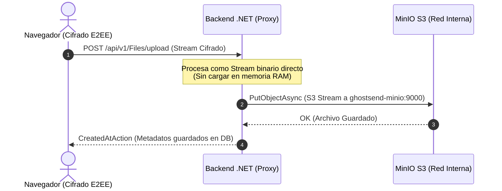

# 🚀 Migración de Almacenamiento: Local File System a MinIO S3 Secure Proxy

Este documento detalla la refactorización arquitectónica realizada en **GhostSend** para migrar el almacenamiento de archivos desde un sistema de archivos local hacia un contenedor auto-hospedado de **MinIO** usando la API de S3, implementando un enfoque de **"Proxy Seguro"** y **"Streaming de Memoria Cero"**.

---

## 🗺️ Comparativa Arquitectónica: Antes vs. Después

### 1. Arquitectura Anterior (Local File System)
Anteriormente, el backend de GhostSend guardaba los bytes de los archivos directamente en el disco duro local de la máquina o volumen asignado al contenedor.

* **Flujo**: Cliente ➡️ Backend (.NET API) ➡️ Disco local (`/app/uploads`).
* **Puntos Críticos**:
  * **Falta de Escalabilidad**: El almacenamiento estaba atado al disco duro del contenedor backend. Si el contenedor se reconstruía sin un volumen persistente bien configurado, los archivos se perdían.
  * **Bloqueos de E/S (I/O)**: La escritura física directa en disco consumía recursos del servidor web principal.
  * **Acoplamiento**: El backend dependía del sistema operativo y los permisos locales de la máquina física para escribir archivos.

---

### 2. Nueva Arquitectura (MinIO S3 Secure Proxy)
Ahora, el almacenamiento está completamente desacoplado utilizando un contenedor independiente de **MinIO** conectado a la red interna privada de Docker (`dokploy-network`).



#### Beneficios Clave del Nuevo Enfoque:
* **Proxy Seguro (Escudo de Anonimato)**: MinIO está aislado en la red interna y **nunca se expone al cliente final**. El backend de .NET actúa como un intermediario exclusivo. El cliente nunca conoce las credenciales ni la dirección IP del almacenamiento.
* **Streaming Directo (Cero Buffers en RAM)**: Diseñado para servidores modestos (como tu Home Server i3 con 8GB RAM). En lugar de leer el archivo completo en la memoria del backend, los bytes fluyen directamente desde la petición HTTP (`Request.Body`) hacia el cliente S3 utilizando un `Stream` binario continuo. **El consumo de RAM es constante y mínimo (pocos megabytes), sin importar si el archivo pesa 10MB o 10GB.**
* **Zero-Knowledge Preservado**: El frontend cifra el archivo en el navegador *antes* de enviarlo. El backend y MinIO solo almacenan y transmiten flujos binarios cifrados ilegibles. Nadie (ni siquiera tú como administrador del servidor) puede leer el contenido de los archivos guardados en MinIO.

---

## 🛠️ Cambios Implementados en el Código

### 1. Inyección de Dependencias y Almacenamiento (`GhostSend.Infrastructure`)
* Se eliminó el repositorio local anterior y se creó **`MinioStorageService`** implementando la interfaz `IStorageService`.
* Este servicio utiliza el cliente oficial **`AmazonS3Client`** adaptado para apuntar a la URL de MinIO.
* Implementa la creación automática del bucket (`EnsureBucketExistsAsync`) al primer arranque si el bucket configurado no existe.
* Todo se opera mediante operaciones nativas asíncronas de stream: `PutObjectAsync` para subidas, `GetObjectAsync` para descargas.

---

### 2. Puente Inteligente de Variables de Entorno (`Program.cs`)
En despliegues de **Dokploy** como aplicación Standalone (independiente), las variables complejas o estructuradas en el archivo `docker-compose.yml` se ignoran. Para resolver esto y permitir que configures tus variables directamente en el panel web de Dokploy de manera intuitiva, creamos un **mapeo dinámico en el arranque de la API**:

```csharp
// Mapea variables planas de Dokploy al árbol de configuración estructurado de .NET
var databaseUrl = Environment.GetEnvironmentVariable("DATABASE_URL")?.Trim(' ', '"');
if (!string.IsNullOrEmpty(databaseUrl))
{
    builder.Configuration["ConnectionStrings:DefaultConnection"] = databaseUrl;
}

var minioUrl = Environment.GetEnvironmentVariable("MINIO_SERVICE_URL")?.Trim(' ', '"');
if (!string.IsNullOrEmpty(minioUrl))
{
    builder.Configuration["MinioSettings:ServiceURL"] = minioUrl;
}
```

* **Escudo contra comillas accidentales**: La función `.Trim(' ', '"')` limpia automáticamente comillas dobles residuales inyectadas por el panel de Dokploy, evitando fallos silenciosos de conexión.
* **Mapeo de CORS y Allowed Hosts**: Traduce automáticamente variables planas (`CORS_ALLOWED_ORIGINS` y `ALLOWED_HOSTS`) al middleware de seguridad de .NET, previniendo los bloqueos y garantizando que solo tu dominio frontend pueda comunicarse con tu API.

---

## 📝 Resumen de la Configuración de Producción (Dokploy)

Para que el backend se conecte con total estabilidad, las variables se configuraron de la siguiente manera:

| Variable de Entorno | Valor de Producción | Propósito |
| :--- | :--- | :--- |
| `DATABASE_URL` | `Host=ghostsend-ghostsenddb-mf4c8n;Port=5432;...` | Conexión directa al contenedor de la base de datos de Dokploy. |
| `MINIO_SERVICE_URL` | `http://ghostsend-minio:9000` | **Conexión interna directa** al contenedor de MinIO sin salir a Internet (usando `container_name`). |
| `CORS_ALLOWED_ORIGINS` | `http://ghostsend.internal` | Permite peticiones AJAX exclusivamente de tu dominio del frontend. |
| `ALLOWED_HOSTS` | `ghostsend-backend.internal` | Seguridad a nivel de host para la API web de .NET. |
| `MAX_FILE_SIZE` | `10737418240` | Límite máximo de archivo permitido (10 GB) adaptado a Kestrel y Forms. |

---

## 🎯 Conclusión y Resultados
Con esta refactorización, GhostSend ha alcanzado un estándar de producción de nivel empresarial:
1. **Escalabilidad Ilimitada**: Almacenamiento centralizado y modular mediante API S3.
2. **Máxima Eficiencia**: Cero buffers en memoria RAM del Home Server.
3. **Seguridad Absoluta**: Tráfico cifrado de extremo a extremo (Zero-Knowledge) y MinIO oculto en la red interna impenetrable.
